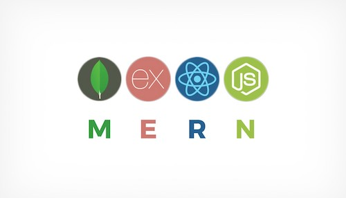
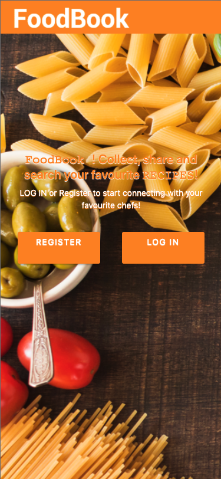
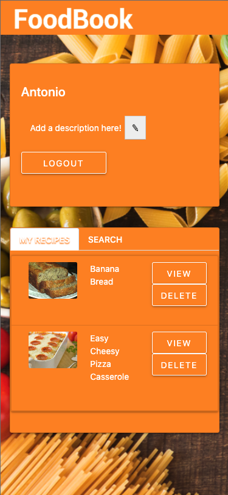
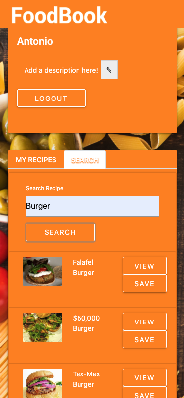

# Foodbook

  


  ## Description

  

  Foodbook is a MERN application that uses REDUX for state management and allows users to search for their favourite recipes. The users also can view more information about the recipes and save them to their personal profile page.

  ## Table of contents
  
  * [Images](#images)
  * [Installation](#installation)
  * [Usage](#usage)
  * [License](#license)
  * [Contributing](#contributing)
  * [Questions](#questions)

  
  ## Images

  

  

  

  
  ## Installation

   The user needs to run:
    ```
    npm install
    ```
  in the command line in order to install the required dependencies for this app on your system. In order to run this app please type in the command line and execute:
    ```
    npm start
    ```
  This app has also been deployed online, please click [here](https://guedesantonio-foodbook.herokuapp.com/) and start using it.

  ## Usage
  
  Open the application on the link above. 
  
  When the user loads the page, he can Register or Login.

  After logging in:

  The user should be able to:

  * Edit his profile description.

  * Toggle between different tabs:

    * Search Tab: 
      1. User can use the input the recipe name to search his desired recipe
      2. User can View more information or Save recipe to his Recipe Book

    * My Recipes Tab: 
      1. User can View more information of his saved recipes
      2. User can Delete recipes from his Recipe Book


  ## License
  This project is licensed under the MIT.

  ## Contributing
  See [Questions](#Questions) section.

  ## Questions
  If you have any questions about the repo, open an issue or contact me directly at gguedesantonio@gmail.com. 
  You can find more about my work at [Github profile](https://github.com/guedesantonio). 
